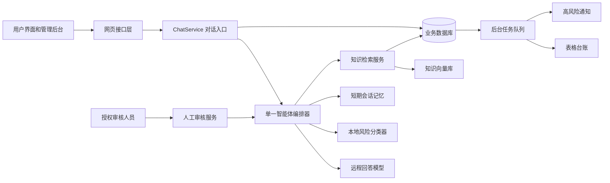
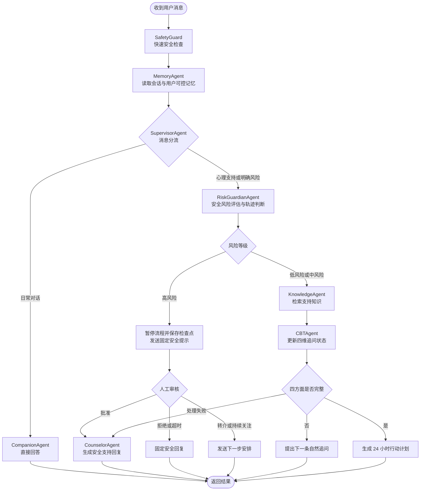

# Xling

Xling 是一个面向一般用户的非诊断性心理健康支持系统。它把日常对话、心理支持、安全风险评估、知识检索、短期行动计划和人工审核连接成一条完整流程。

项目不进行疾病诊断，不提供药物建议，不替代专业人员，也不承担紧急救援。正式部署时，部署方必须完成当地的专业、法律和安全审查，并配置适用的专业支持与紧急资源。

## 项目功能

- 日常对话与心理支持分流：普通问题直接回答，压力、焦虑、低落、睡眠和关系等困扰进入心理支持流程。
- 分层安全保护：明确危险信号优先由规则识别，再结合分类模型和近期风险变化，得到低、中、高三级安全风险。
- 人工审核：高风险消息会暂停自动流程，先向用户发送固定安全提示；界面保持“等待审核”状态，直到授权审核人员批准、拒绝、转介或安排后续关注。
- 认知行为四维追问：使用 CBT（认知行为方法，通过事件、想法、身体反应和行为四方面梳理困扰）逐步理解用户当前处境。
- 24 小时行动计划与次日反馈：四方面信息完整后生成可逐项执行的计划；次日反馈没有改善或情况恶化时可再次进入人工审核。
- 知识增强回答：使用 RAG（先检索知识库，再让模型依据相关内容回答）提供更稳定的心理健康支持信息。
- 用户可控记忆：分别管理当前会话、用户主动填写的支持背景和用户确认的长期记忆卡片；无记忆会话不会读取或新增长期记忆。
- 自愿量表筛查：提供 PHQ-9（抑郁相关筛查问卷）和 GAD-7（焦虑相关筛查问卷），结果只用于筛查与趋势参考，不作为诊断。
- 管理后台：查看安全评估、人工审核、对话、知识库、任务执行记录和失败任务。
- 可靠的报告与通知：安全记录、审核请求和后续任务先统一写入数据库，再由后台队列生成表格台账和发送高风险通知。
- 模型训练与评测：包含分类模型微调，以及分类、安全、检索、回答质量和端到端流程评测。

## 核心架构

Xling 采用“一个编排器 + 多个专职智能体”的架构。

它不是多个智能体相互自由对话，也不是每个智能体各自运行一个服务。所有智能体都在同一个应用进程中，由一个编排器按固定条件调度，并通过同一份 `AgentContext`（一次对话处理过程的共享状态）传递结果。

默认编排器是 LangGraph（用流程图组织智能体执行顺序和状态的框架）。如果 LangGraph 不可用，系统会降级到自研的最多 8 步有限循环；完整的流程检查点、暂停和恢复能力由 LangGraph 路径提供。



架构的核心不是让模型自由决定一切，而是把安全顺序写成明确流程：先做快速安全检查，再读取记忆和分流；心理支持消息必须先完成安全风险评估，高风险消息不能先进入知识检索或普通回答。

## 智能体职责

| 智能体 | 职责 | 主要方式 |
| --- | --- | --- |
| `SafetyGuard` | 在任何记忆读取之前检查明确高风险表达 | 固定规则 |
| `MemoryAgent` | 读取当前会话、支持背景和已确认记忆卡片，并生成简短记忆摘要 | 短期存储、业务数据库、模型摘要 |
| `SupervisorAgent` | 把消息分为日常对话、心理支持或明确风险 | 规则优先，模型补充 |
| `RiskGuardianAgent` | 判断低、中、高风险，并结合近期记录识别持续上升趋势 | 明确规则、分类模型、风险轨迹 |
| `KnowledgeAgent` | 改写检索词并查找相关知识内容 | 向量检索，失败时使用本地混合检索 |
| `CBTAgent` | 完成四维追问；信息完整后生成 24 小时行动计划 | 结构化状态与模型生成 |
| `CompanionAgent` | 回答日常学习、编程和普通生活问题 | 通用对话模型 |
| `CounselorAgent` | 生成非诊断性的心理支持回复；高风险时只在人工批准后继续 | 检索知识、共享上下文和模型生成 |

这些名称表示编排流程中的专职角色，不表示八个独立模型。回复模型、分类模型、数据库和知识库由这些角色按职责共享使用。

开发和实际联调采用“远程回答模型 + 本地风险分类器”的分工：日常回答、心理支持回复和结构化内容由兼容 OpenAI 的远程接口生成；安全风险分类由本机 Ollama 中的分类模型完成。两者相互独立，远程回答接口不可替代本地风险分类器。`mock` 模式会同时模拟这两部分，只用于无外部依赖的演示和自动测试。

## 编排流程



每轮对话的用户消息、安全评估、人工审核请求和待执行任务在一次数据库事务中保存。模型生成的回复随后单独保存。表格和通知由后台任务执行，失败后会重试；超过重试次数的任务进入失败记录，避免阻塞用户回复或静默丢失。

## 数据与运行组件

| 组件 | 用途 |
| --- | --- |
| FastAPI（Python 网页服务框架） | 提供登录、对话、行动计划、筛查、管理后台和健康检查接口 |
| LangGraph | 执行默认智能体流程，保存流程检查点，并支持高风险暂停与人工恢复 |
| MySQL（关系型数据库） | 保存用户、会话、消息、筛查、计划、安全评估、审核和任务记录 |
| Redis（高速缓存服务） | 保存有时限的短期对话记忆和四维追问进度；不可用时有进程内降级存储 |
| Chroma（向量数据库） | 保存知识向量并执行相似内容检索；应用启动时检查数据库与向量索引是否一致并自动补齐，向量服务不可用时回退到本地关键词与文本相似度检索 |
| 兼容 OpenAI 的远程接口 | 提供回答模型；也可提供知识向量，或为知识向量单独配置另一服务商 |
| Ollama（本地模型运行工具） | 运行本地风险分类器；仅在显式选择本地回答模式时同时承担回答模型 |
| 后台任务队列 | 非阻塞地生成表格台账、发送通知、重试失败任务并记录最终失败 |
| MCP | 模型上下文协议，用统一接口调用表格写入和风险通知工具；默认在线路径使用持久化队列 |
| Caddy | 作为部署入口，处理 HTTPS（加密网页连接）和请求转发 |

## 目录结构

```text
.
├── app/                          # 在线应用代码
│   ├── main.py                   # FastAPI 应用入口、启动任务和静态页面挂载
│   ├── agents/                   # 多智能体编排
│   │   ├── factory.py            # 选择 LangGraph 或降级运行方式
│   │   ├── langgraph_runtime.py  # 默认流程图、条件分支、检查点、暂停与恢复
│   │   └── runtime.py            # 共享状态、八个智能体职责和有限循环运行方式
│   ├── api/                      # 对外接口
│   │   ├── account.py            # 登录、支持背景、记忆卡片、筛查和账户删除
│   │   ├── support.py            # 流式对话、会话、行动计划和次日反馈
│   │   ├── admin.py              # 报告、知识库、任务记录和人工审核
│   │   ├── system.py             # 健康检查与智能体状态
│   │   └── routes.py             # 汇总所有接口
│   ├── core/                     # 配置、数据库、安全、时间和数据版本
│   ├── models/                   # MySQL 数据表定义
│   ├── schemas/                  # 接口请求与响应的数据结构
│   ├── services/                 # 业务能力实现
│   ├── knowledge/                # 内置心理健康支持知识和安全规则
│   ├── mcp_tools/                # 表格与通知的 MCP 工具入口
│   └── static/                   # 用户界面、管理后台、样式和浏览器脚本
├── evals/                        # 离线评测
│   ├── classifier/               # 分类模型评测
│   ├── risk/                     # 安全风险识别与校准评测
│   ├── rag/                      # 知识检索评测
│   ├── quality/                  # 回复质量评测
│   └── e2e/                      # 完整流程评测
├── finetune/                     # 分类模型数据、训练配置、训练和打包脚本
├── models/                       # Ollama 模型定义；大型模型文件不提交到仓库
├── scripts/                      # 开发启动、模型创建和发布打包脚本
├── tests/                        # 单元测试、接口测试、流程恢复和数据库事务测试
├── docs/                         # 领域术语、架构决策和部署说明
├── .scratch/                     # 已实施功能的需求拆分与验收材料
├── idea-stage/                   # 实验前的研究约束
├── refine-logs/                  # 实验计划、执行记录、结果和代码审查
├── data/                         # 本地运行生成的向量库、检查点和台账，不作为源码维护
├── .env.example                  # 本地开发与无模型演示配置样例
├── .env.production.example       # 正式部署配置样例
├── docker-compose.yml            # Caddy、应用、MySQL 和 Redis 的容器编排
├── Dockerfile                    # 应用镜像构建方式
├── Caddyfile                     # HTTPS 和请求转发规则
├── requirements*.txt             # 运行、开发和可选检索依赖
├── pyproject.toml                # 测试、代码检查和类型检查配置
├── CONTEXT.md                    # 项目统一领域术语
├── MANIFEST.md                   # 研究与模型产物登记
└── EXPERIMENT_AUDIT.*            # 实验完整性审计结果
```

`app/services/` 是主要业务实现层，文件按以下职责组织：

- `chat.py`、`support_turn.py`：接收一轮对话、调用编排器，并以一次事务保存最终事实。
- `ai.py`、`assessment.py`、`risk_trajectory.py`：连接模型、完成安全风险判断并跟踪跨消息变化。
- `knowledge.py`、`vector_store.py`、`bge_retrieval.py`：知识切分、向量检索、本地回退和离线检索实验。
- `cbt.py`、`action_plan.py`、`checkin.py`、`escalation.py`：四维追问、行动计划、次日反馈和安全升级闭环。
- `memory.py`、`memory_cards.py`、`user_profile.py`：短期记忆、确认式长期记忆和用户支持背景。
- `review.py`、`report.py`、`report_dispatch.py`：人工审核、安全记录查询和后续任务投递。
- `tool_queue.py`、`tools.py`、`mcp_client.py`：任务排队、表格与通知执行，以及 MCP 工具调用。
- `screening.py`、`privacy.py`、`data_deletion.py`：自愿量表、敏感信息处理和账户数据删除。
- `model_assets.py`、`risk_calibration.py`：模型产物状态和离线风险校准实验。

## 快速启动

需要 Docker（用容器打包和运行应用的工具）和 Docker Compose（同时启动多个容器的编排工具）：

```bash
cp .env.example .env
docker compose up -d --build
```

`.env.example` 默认使用 `AI_PROVIDER=mock`，因此不需要先安装或连接真实模型。启动后访问 `https://localhost`；浏览器可能提示本地证书需要确认。

开发演示账号：

- 普通用户：`student` / `student123`
- 管理员：`admin` / `admin123`

这些账号只用于本地演示，正式部署前必须删除或更换，并在 `.env` 中设置随机且足够长的 `JWT_SECRET_KEY`（登录令牌签名密钥）。

### 真实模型联调

真实模型联调需要同时配置远程回答模型和本地风险分类器：

```dotenv
AI_PROVIDER=openai
AI_MAX_TOKENS=2048
OPENAI_BASE_URL=https://api.openai.com/v1
OPENAI_API_KEY=在本机填写有效密钥
OPENAI_MODEL=gpt-4o-mini

OLLAMA_BASE_URL=http://host.docker.internal:11434
OLLAMA_CLASSIFIER_MODEL=xling-cls-3b-ft:latest
```

- `AI_PROVIDER=openai` 表示回答走兼容 OpenAI 的远程 API（应用程序接口）。
- `AI_MAX_TOKENS` 是单次回答允许生成的最大模型计量单位数，默认 2048；调高会增加响应时间和模型费用。
- `OPENAI_BASE_URL`、`OPENAI_API_KEY` 和 `OPENAI_MODEL` 必须属于同一个远程服务。
- `OLLAMA_BASE_URL` 是容器访问 Mac 上 Ollama 的地址；直接在 Mac 上运行应用时使用 `http://localhost:11434`。
- `OLLAMA_CLASSIFIER_MODEL` 必须是 `ollama list` 中已存在、并经部署方验证的本地风险分类器名称。仓库中的通用分类器实验在完成人工复核前不会自动替换默认模型。

如需启用真实知识向量检索，还需配置：

```dotenv
KNOWLEDGE_VECTOR_ENABLED=true
KNOWLEDGE_VECTOR_REQUIRED=false
EMBEDDING_BASE_URL=https://your-embedding-provider.example/v1
EMBEDDING_API_KEY=在本机填写有效密钥
OPENAI_EMBEDDING_MODEL=向量模型名称
```

应用启动时会检查知识正文与向量索引是否一致；发现向量条目缺失时会自动补齐。`KNOWLEDGE_VECTOR_REQUIRED=false` 表示向量接口暂时不可用时允许回退到本地检索，避免阻塞应用启动。

MySQL（关系型数据库）的管理员密码由 `MYSQL_ROOT_PASSWORD` 设置，容器健康检查会读取同一配置。修改默认密码时不需要同步修改 `docker-compose.yml`。

## 本地开发与验证

项目使用 Python 3.12。本地直接启动应用前，需要有可用的 MySQL、Redis，以及所选模型服务；只运行测试不需要这些外部服务。

```bash
python3 -m venv .venv
.venv/bin/pip install -r requirements-dev.txt
.venv/bin/python -m pytest -q
.venv/bin/ruff check app evals tests
.venv/bin/mypy --ignore-missing-imports app evals
```

如需运行本地风险分类器，可先使用 `scripts/start-ollama.sh` 启动 Ollama，再用 `scripts/create-classifier-model.sh` 注册分类模型。`scripts/create-finetuned-model.sh` 只用于显式选择本地回答模型的可选模式，不是远程回答模型联调的前置条件。
